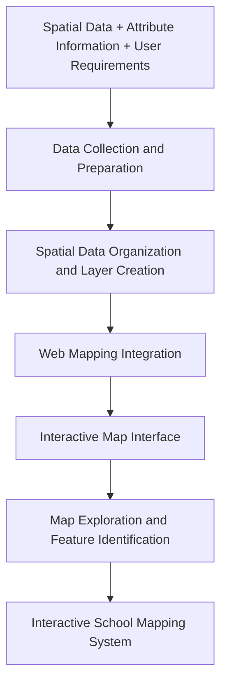

# Conceptual Framework

```mermaid
flowchart TD
    A[Spatial Data + Attribute Information + User Requirements] --> B[Data Collection and Preparation]
    B --> C[Spatial Data Organization and Layer Creation]
    C --> D[Web Mapping Integration]
    D --> E[Interactive Map Interface]
    E --> F[Map Exploration and Feature Identification]
    F --> G[Interactive School Mapping System]
```