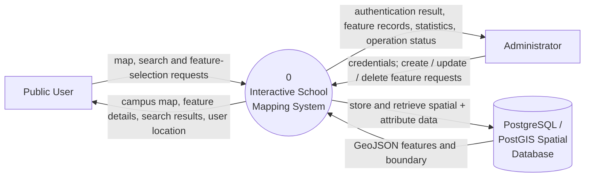
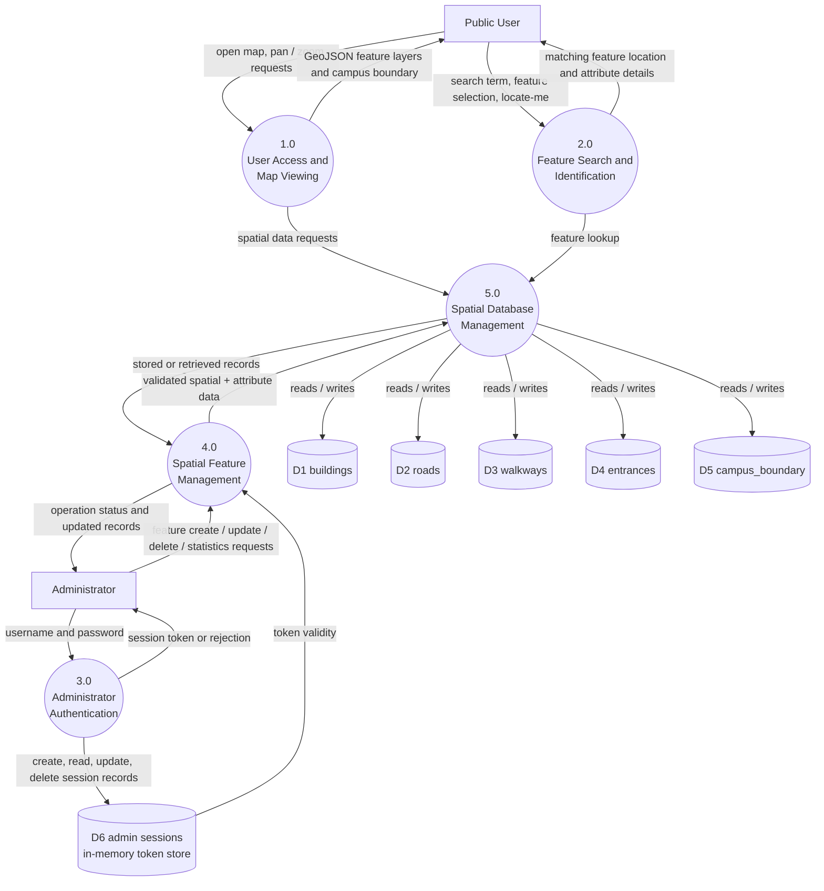
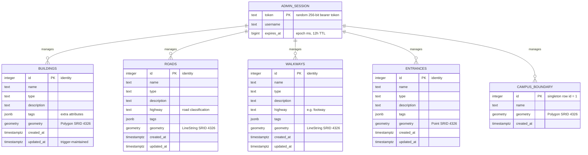
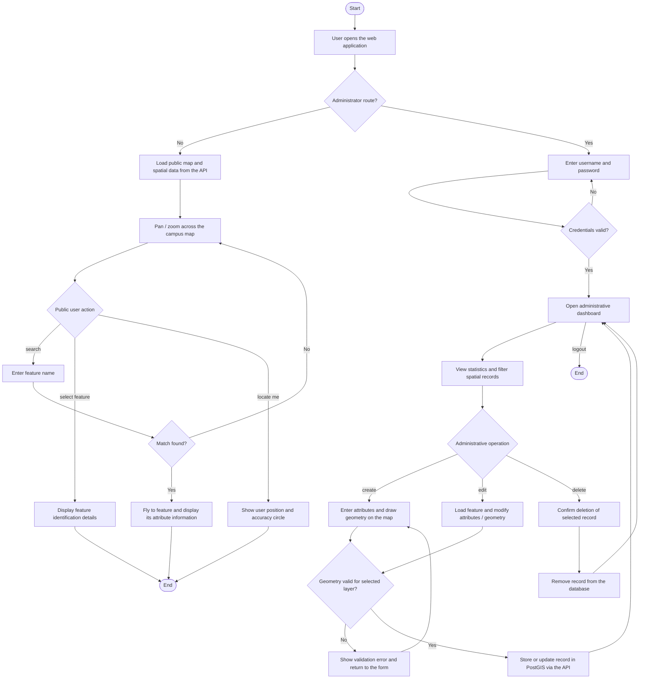

# Chapter Three — System Diagrams (Mermaid)

Mermaid sources for the Chapter Three figures of the project report. Rendered
PNG copies live in `figures/` (`fig-3-1.png` … `fig-3-4.png`).

Regenerate after editing a block below:

```bash
npx -y @mermaid-js/mermaid-cli -i <block>.mmd -o figures/fig-3-x.png -b white -s 2
```

---

## Figure 3.1 — Context Diagram (Level 0 DFD)

The system as a single process, with its external entities and the spatial
database it serves.



---

## Figure 3.2 — Level 1 Data Flow Diagram (DFD)

Decomposition into the five major processes, with the spatial data stores.



---

## Figure 3.3 — Entity-Relationship (E-R) Diagram

Logical structure of the spatial database. Each spatial layer carries its own
geometry and attributes; there are no foreign keys between layers — they are
maintained as separate feature layers managed through one application. The
administrator session is an application-level entity (in-memory bearer-token
store), shown to reflect the access-control design in section 3.7.5.



---

## Figure 3.4 — System Flowchart

Logical sequence of operations for both the public user and the administrator,
including the geometry-validation gate on administrative writes (section 3.7.6).


